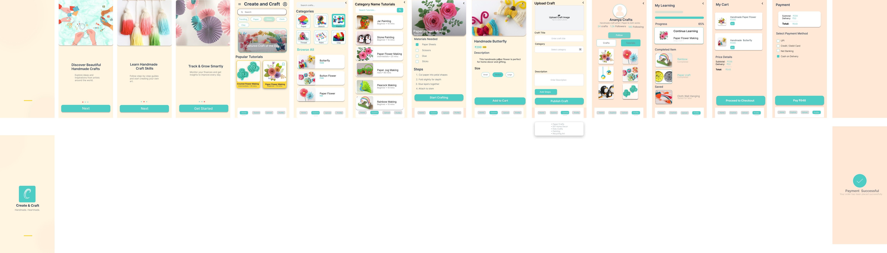
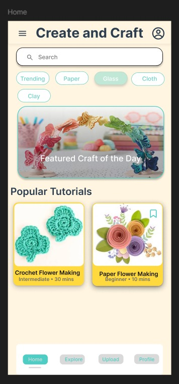
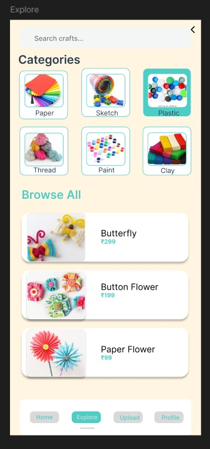
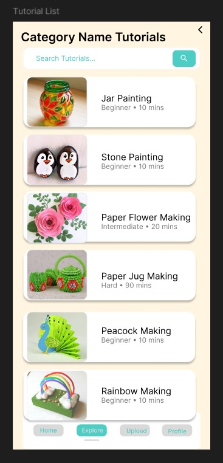
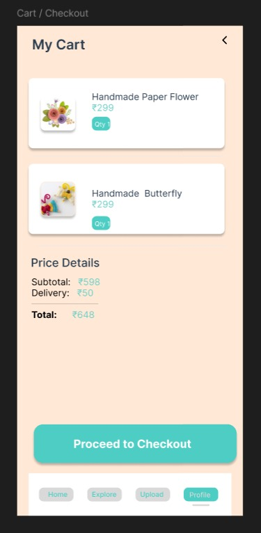
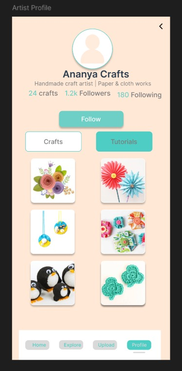

# 🎨 Create & Craft – UI/UX Design Project

## 🔗 Figma Design
[View Full Design]([PASTE-YOUR-FIGMA-LINK-HERE](https://www.figma.com/proto/xlJ1hn74A1jLvRIdXqnHRS/create---craft?node-id=2085-77&p=f&t=gF5Z5GUVBg3kre8V-1&scaling=min-zoom&content-scaling=fixed&page-id=0%3A1&starting-point-node-id=2002%3A2&show-proto-sidebar=1))

---

## 📌 Project Overview
Create & Craft is a mobile application designed to showcase and explore handmade crafts and creative products. The goal of this project is to provide a clean, minimal, and user-friendly interface that enhances the browsing and shopping experience for craft lovers.

---

## 🎯 Objectives
- Design a visually appealing craft-based mobile app
- Ensure smooth and intuitive user navigation
- Highlight handmade products effectively
- Maintain a clean and minimal UI design

---

## ✨ Key Features
- 🏠 Simple and clean home screen
- 🛍 Easy product browsing experience
- 📄 Detailed product view
- 🛒 Smooth cart and checkout flow
- 👤 User-friendly profile section

---

## 🛠 Tools Used
- Figma (UI/UX Design)

---

## 🎨 Design Highlights
- Consistent spacing and alignment
- Minimal and modern color palette
- Clear typography hierarchy
- User-centered layout design

---

## 📷 Screens

### 🧩 Overview

### 🏠 Home Screen

### 🔍 Explore Crafts

### 📚 Tutorial List

### 🛒 Cart

### 👤 Profile

## 🚀 Future Improvements
- Convert design into a working frontend using HTML, CSS, and React
- Add animations and micro-interactions
- Improve accessibility and responsiveness

---

## 👩‍💻 Author
Subiksha J
